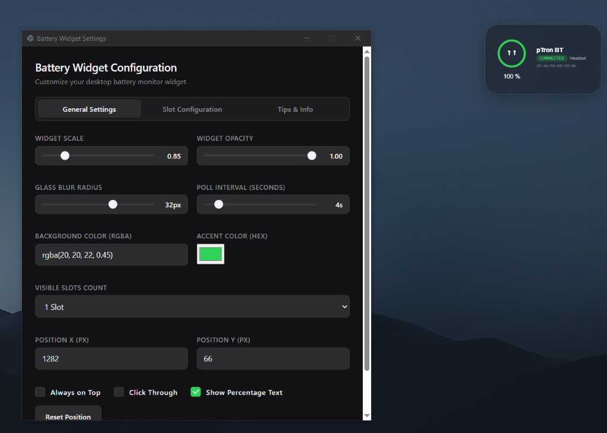
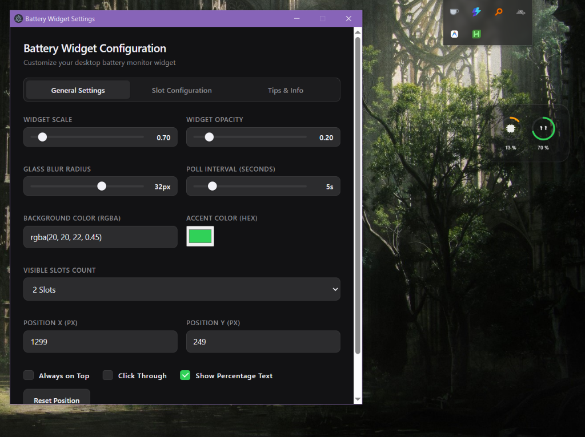

# 🔋 iOS-Style Desktop Battery Widget for Windows

<div align="center">

[](https://github.com/wasifshaffaq/widget/releases)
[](#)
[](#)
[](LICENSE)

</div>

A premium, highly customizable, translucent desktop widget for Windows that replicates the clean aesthetic of the iOS battery widget. It monitors and visualizes your PC's resource metrics and connected Bluetooth accessories in real-time, complete with intelligent device routing and category prioritization.

---

## 📸 Preview

<div align="center">
  <h3>Widget UI</h3>
  
  <br/><br/>
  <h3>Settings Panel</h3>
  
</div>

---

## ✨ Features

* **🎨 iOS Aesthetic & Translucency:** Uses native Windows graphics layering combined with Gaussian blur (`backdrop-filter`) and light border highlights to deliver a modern, premium look.
* **📌 Native Desktop Pinning:** The widget embeds itself directly into the Windows `WorkerW` layer, pinning it safely behind your desktop icons and apps (like Rainmeter or Wallpaper Engine). It stays glued to the wallpaper and never disappears when using "Show Desktop" (Win+D).
* **📈 Resource & Device Monitoring:** Supports CPU usage, RAM utilization, laptop battery charging state, and paired Bluetooth device batteries.
* **🎧 Intelligent Bluetooth Routing:**
  * Auto-routing dynamically binds to whichever Bluetooth device is actively online.
  * Filters out cached offline devices using the Windows PnP connection status.
  * Scans device properties and automatically translates names (e.g. `pTron BT` instead of `pTron BT Hands-Free AG`).
* **⭐ Device Priority Engine:** If multiple Bluetooth devices are active (e.g. a mouse and earbuds), it automatically prioritizes and displays wearables or audio devices (`Headset`, `Audio Device`, `Watch`) first, falling back to other peripherals if none are active.
* **⚙️ Dynamic Settings Panel:** Adjust scale (between `0.5` and `1.5`), opacity, glass blur radius, refresh rates, slot count, position offsets, and toggle "Always on Top" or "Click-Through" modes instantly.
* **🚀 Silent Boot Autostart:** Registers automatically in the Windows startup registry. Runs natively in the background silently on boot with no command prompt windows popping up.

---

## 📦 Installation (For End Users)

1. Go to the **Releases** section on the right side of this repository.
2. Download the latest **`BatteryWidget Setup 1.0.0.exe`** installer.
3. Run the installer `.exe` on your Windows PC.
4. The setup wizard will:
   * Install the widget files to your system.
   * Add a shortcut to your Desktop and Start Menu.
   * Configure the widget to launch automatically whenever your PC boots up.
5. The widget will launch instantly upon completion!

---

## 🛠️ Development Setup (For Contributors)

If you want to run the project from source code or modify it:

### Prerequisites
* [Node.js](https://nodejs.org/) (v16 or higher)
* [npm](https://www.npmjs.com/) (installed automatically with Node)

### Installation
1. Clone this repository to your local machine:
   ```bash
   git clone https://github.com/wasifshaffaq/widget.git
   cd widget
   ```
2. Install the development dependencies:
   ```bash
   npm install
   ```

### Running the App
* **Start in Development Mode:**
   ```bash
   npm start
   ```
* **Run Logical Test Suite:**
   ```bash
   npm test
   ```
* **Package into a Portable Directory:**
   ```bash
   npm run package
   ```

---

## 🖱️ How to Use & Controls

* **Moving the Widget:** Click and hold anywhere on the widget card body to drag and reposition it on your desktop. Release to lock it in place (its coordinates are saved automatically).
* **System Tray Context Menu:**
  * **Right-click the Tray Icon** (green battery icon) in your taskbar to quickly toggle **Always on Top**, **Click-Through Mode**, hide/show the widget, or exit.
  * **Double-click the Tray Icon** to open the settings panel.
* **Dynamic Slot Configuration:** Open settings and configure how many slots to display (`1` to `4` slots).
  * Setting the slot type to `bluetooth_device` and leaving the name empty enables **intelligent auto-detection**.
  * Alternatively, type a manual name to bind the slot to a specific device.

---

## 📄 License

This project is licensed under the MIT License. See the [LICENSE](LICENSE) file for details.
